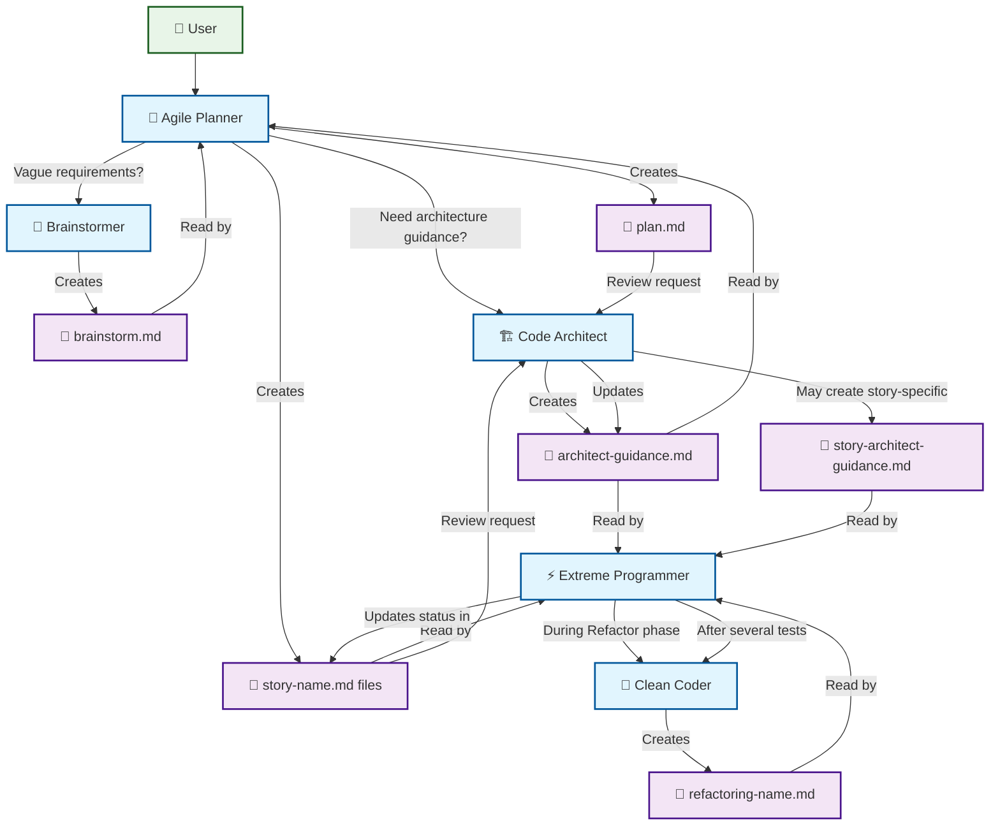

# Chatmode Workflow Diagram

Open this file in VS Code's markdown preview (Cmd+Shift+V) to see the rendered diagram.

## How to View This Diagram:

1. **In VS Code**: Press `Cmd+Shift+V` while viewing this markdown file
2. **The diagram should render automatically** in the preview pane

## Workflow Description:

- **User** initiates feature requests
- **Agile Planner** orchestrates the entire workflow
- **Brainstormer** gathers detailed requirements when needed
- **Code Architect** provides structural guidance
- **Extreme Programmer** implements using TDD cycles
- **Clean Coder** suggests improvements during refactoring

Each agent creates specific files that other agents consume, creating a cohesive workflow that supports test-driven development and incremental feature delivery.