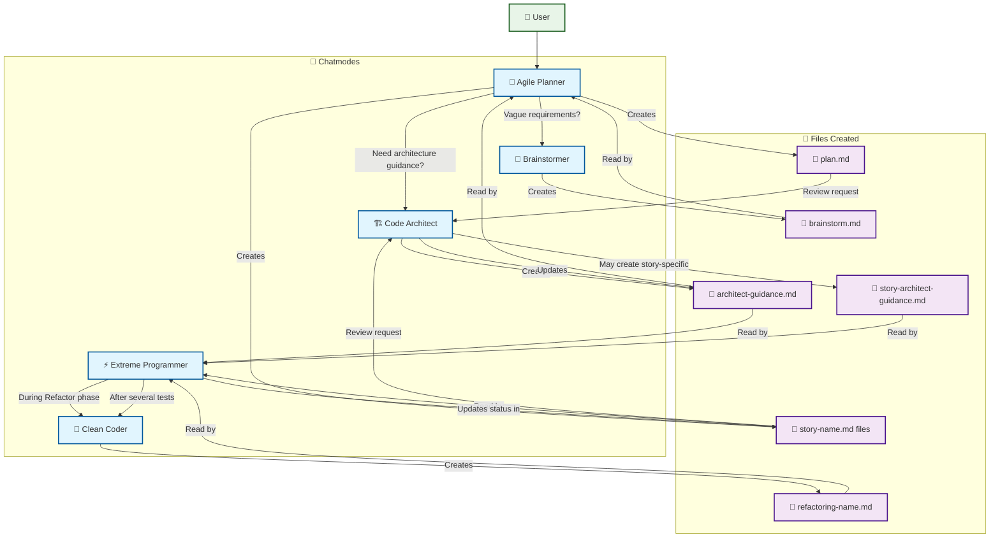

# Chatmode Workflow and Interactions

This diagram shows how the different chatmodes work together in the ourFakeStore project, including the files they create and consume.

## Workflow Description

### 1. **Feature Initiation** 
- User requests a new feature
- **Agile Planner** assesses if requirements are clear

### 2. **Requirements Gathering** (if needed)
- **Agile Planner** → **Brainstormer** for vague requirements
- **Brainstormer** creates `brainstorm.md` with detailed requirements
- **Agile Planner** reads `brainstorm.md` to understand feature scope

### 3. **Architecture Planning**
- **Agile Planner** → **Code Architect** for architectural guidance
- **Code Architect** creates `architect-guidance.md` with structural recommendations
- **Agile Planner** reads guidance to inform planning decisions

### 4. **Feature Planning**
- **Agile Planner** creates:
  - `plan.md` - Master feature plan with story overview
  - `story-name.md` files - Individual story breakdowns with test/task sequences

### 5. **Implementation Cycle**
- **Extreme Programmer** reads `story-name.md` and `architect-guidance.md`
- During Red-Green-Refactor cycles:
  - **Extreme Programmer** → **Clean Coder** during refactor phase
  - **Clean Coder** creates `refactoring-name.md` with improvement suggestions
  - **Extreme Programmer** applies suggestions and updates story status

### 6. **Continuous Review**
- **Code Architect** reviews `plan.md` and story files periodically
- May create story-specific `story-architect-guidance.md` for complex stories
- **Extreme Programmer** incorporates architectural feedback

## Key Integration Points

- **File-based communication**: Agents communicate through structured markdown files
- **Status tracking**: Story files maintain current implementation status
- **Iterative refinement**: Architecture guidance evolves with implementation needs
- **Test-driven focus**: All workflows support the TDD Red-Green-Refactor cycle