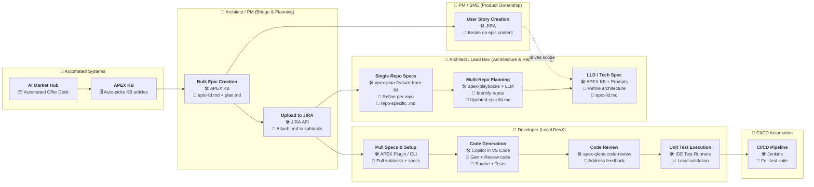

# Swimlane Ownership Workflow (Platform → Bridge → DevX)

This diagram represents the workflow as **swimlanes by ownership** (roles/systems),
showing clear handoffs from automation → product/architecture planning → developer execution → CI/CD.

---

## Mermaid Diagram (Swimlane / Ownership Model)

